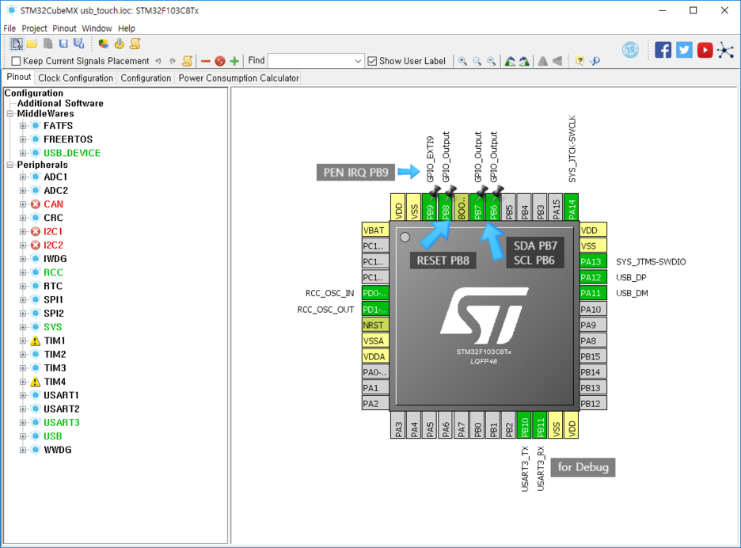
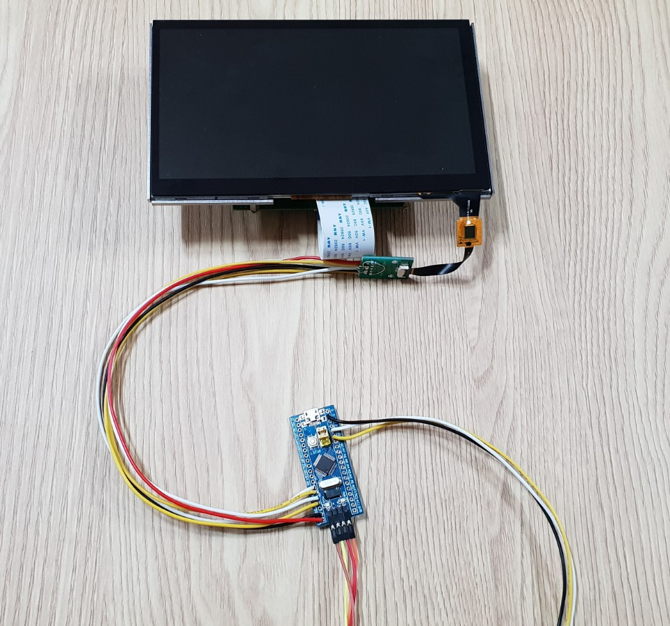
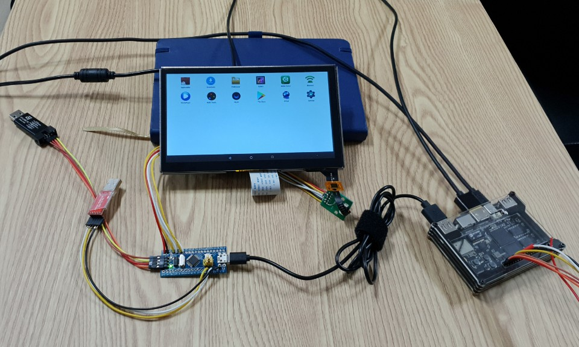

# stm32_i2c_to_usb_hid_multitouch
i2c to usb hid multi touch with stm32

### Pin Config

### Touch Monitor Connection

Touch Controller is FT5316

### KVIM2(Android OS) Connection

### Demo Video Link
https://youtu.be/WPxBueGO-0M

### Demo Video Link(on Windows 10)
https://youtu.be/_ofgHura1hs

